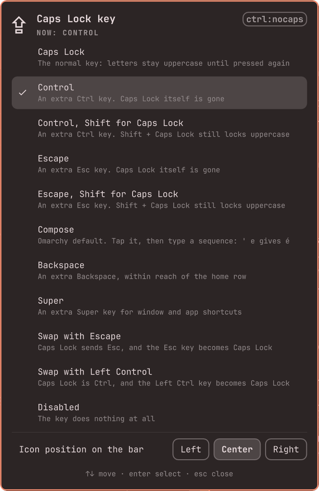

# Caps Lock Remap — Omarchy bar widget

Pick what the Caps Lock key does from a menu on the bar. Every choice comes
with a line saying what it does, applies the moment you click it, and survives
a restart.



Each mapping is a stock XKB option that Hyprland hands to the keymap, so there
is no remapping daemon and nothing running in the background.

## Install

```sh
omarchy plugin add https://github.com/zamia/omarchy-caps-lock-remap.git --enable
```

The ⇪ icon lands in the right section of the bar. Move it from the panel
itself (see below) or with:

```sh
omarchy bar move io.github.zamia.caps-lock-remap --section left
```

## Usage

Click the icon, then click a mapping. The current one is ticked, and hovering
the icon names it.

| Mapping | Caps Lock becomes | XKB option |
|---|---|---|
| Caps Lock | The normal key | `caps:capslock` |
| Control | An extra Ctrl | `ctrl:nocaps` |
| Control, Shift for Caps Lock | An extra Ctrl; Shift + Caps Lock still locks uppercase | `caps:ctrl_shifted_capslock` |
| Escape | An extra Esc | `caps:escape` |
| Escape, Shift for Caps Lock | An extra Esc; Shift + Caps Lock still locks uppercase | `caps:escape_shifted_capslock` |
| Compose | The Compose key (Omarchy's default) | `compose:caps` |
| Backspace | An extra Backspace | `caps:backspace` |
| Super | An extra Super | `caps:super` |
| Swap with Escape | Esc, and the Esc key becomes Caps Lock | `caps:swapescape` |
| Swap with Left Control | Ctrl, and Left Ctrl becomes Caps Lock | `ctrl:swapcaps` |
| Disabled | Nothing | `caps:none` |

The row at the bottom of the panel moves the icon between the left, center,
and right sections of the bar.

In the panel:

| Key | Does |
|---|---|
| `↑` `↓`, `j` `k` | Move the cursor |
| `←` `→`, `h` `l` | Choose a section on the icon-position row |
| `enter`, `space` | Select the highlighted row |
| `esc` | Close |

The panel shows what Hyprland is using right now, not what was last clicked,
so it stays correct when you change `kb_options` by hand or with another tool.

## What it changes on your system

Nothing, until you pick a mapping. The first pick:

- creates `~/.config/hypr/caps-lock-remap.lua`, which holds the choice;
- appends a two-line loader for that file to the end of
  `~/.config/hypr/hyprland.lua`, after saving a copy as
  `hyprland.lua.bak.<timestamp>`;
- runs `hyprctl reload config-only`.

The generated file replaces only the options that bind Caps Lock. Any other
option in your `kb_options` (layout switching, for example) is kept as it is.

## IPC

```sh
omarchy-shell io.github.zamia.caps-lock-remap toggle
omarchy-shell io.github.zamia.caps-lock-remap set caps:escape
omarchy-shell io.github.zamia.caps-lock-remap current
```

`set` takes any option from the table above, so a Hyprland bind can switch
mapping without opening the menu.

## Limits

- XKB has no tap-versus-hold, so "Esc on tap, Ctrl on hold" is not possible
  here. That needs a remapper such as keyd or kanata.
- A `kb_options` set for one keyboard with `hl.device` wins over this for
  that keyboard.
- Config loaded after the loader line can override the choice.
- Hyprland's Lua config (`hyprland.lua`) is required. The legacy
  `hyprland.conf` is not supported.

## Requirements

Omarchy 4 with the Omarchy shell. It uses `hyprctl`, `jq`, and `bash`, all of
which Omarchy ships. No other dependencies.

## Removal

Run the uninstall step first, because it lives inside the plugin folder:

```sh
~/.config/omarchy/plugins/io.github.zamia.caps-lock-remap/capsremapctl uninstall
omarchy plugin remove io.github.zamia.caps-lock-remap
```

`uninstall` deletes `~/.config/hypr/caps-lock-remap.lua` and takes the loader
lines back out of `hyprland.lua` (saving a backup first), which hands Caps
Lock back to your own config. To keep the plugin but drop the choice, run
`capsremapctl reset` instead.

## License

MIT. See [LICENSE](LICENSE).
